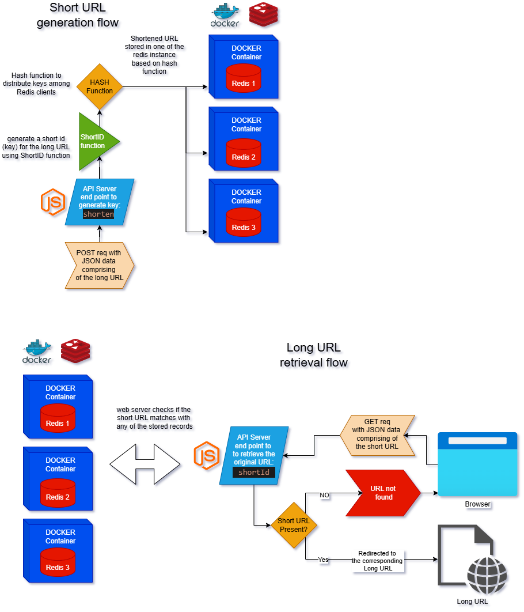

# Scalable URL Shortener

## Summary

This project is a URL Shortener application that allows users to shorten long URLs into more manageable, shorter links. The application provides a simple interface for users to input their long URLs and receive a shortened version that redirects to the original URL when accessed.

Key features include:

- Shortening long URLs
- Redirecting shortened URLs to the original links
- Key Distribution
- Exception Handling
- Containerization

This project is useful for managing and sharing long URLs in a more convenient and efficient manner.

## Architecture Diagram

Below is the architecture diagram for the Scalable URL Shortener:

