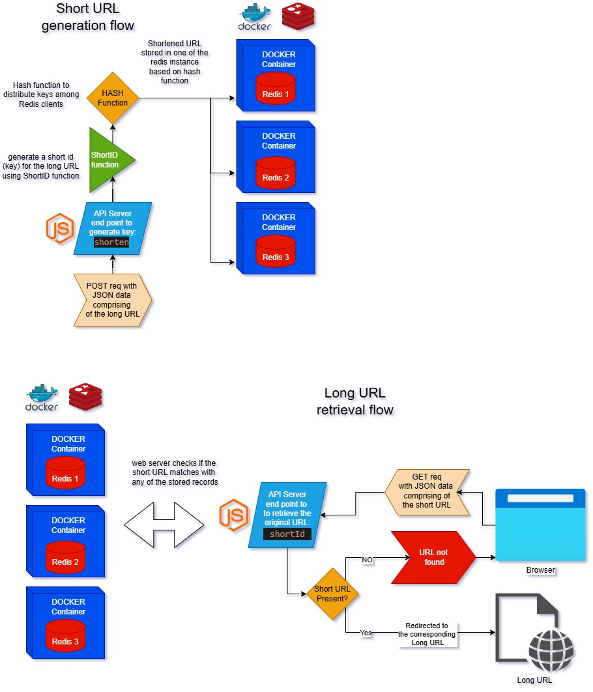

# URL Shortener

<br>

## Summary

This project is a URL Shortener application that allows users to shorten long URLs into more manageable, shorter links. The application provides a simple interface for users to input their long URLs and receive a shortened version that redirects to the original URL when accessed.

Key features include:

- Shortening long URLs
- Redirecting shortened URLs to the original links
- Key Distribution
- Exception Handling
- Containerization

This project is useful for managing and sharing long URLs in a more convenient and efficient manner.

<br>

## To Run This App:

Prerequisites
Before starting, make sure you have the following installed:

- Node.js (v14 or higher)
- Redis
- Docker
- Basic knowledge of JavaScript, Node.js, and Redis.

Once you clone the project, open a CLI to the project root directory and
follow the steps previded below:

### step 1: setting up the project

```
mkdir scalable-url-shortener
cd scalable-url-shortener
npm init -y
```

```
npm install express redis shortid dotenv
```

`express` : A lightweight web server framework.

`redis`: To handle caching.

`shortid`: For generating short, unique IDs.

`dotenv`: For managing environment variables.

Create a `.env` file in the root of your project:

```
PORT=3000
REDIS_HOST_1=localhost
REDIS_PORT_1=6379
REDIS_HOST_2=localhost
REDIS_PORT_2=6380
REDIS_HOST_3=localhost
REDIS_PORT_3=6381
```

These variables define the Redis hosts and ports we'll be using.

### Step 2: Setting Up Redis Instances

Run the following commands to start three Redis containers:

```
docker run -p 6379:6379 --name redis1 -d redis
docker run -p 6380:6379 --name redis2 -d redis
docker run -p 6381:6379 --name redis3 -d redis
```

This will set up three Redis instances running on different ports.
We'll use these instances to implement consistent hashing and sharding.

### Step 3: Testing the Application

1. Start your Redis instances:
   ```
   docker start redis1 redis2 redis3
   ```
2. Run the Node.js server:
   ```
   node index.js
   ```
3. Test the endpoints using curl or Postman:

   - Shorten a URL:

     ```
     POST http://localhost:3000/shorten Body: { "url": "https://example.com" }
     ```

   - Access the shortened URL:
     ```
     GET http://localhost:3000/{shortId}
     ```

<br>

## Architecture Diagram

Below is the architecture diagram for the Scalable URL Shortener:


